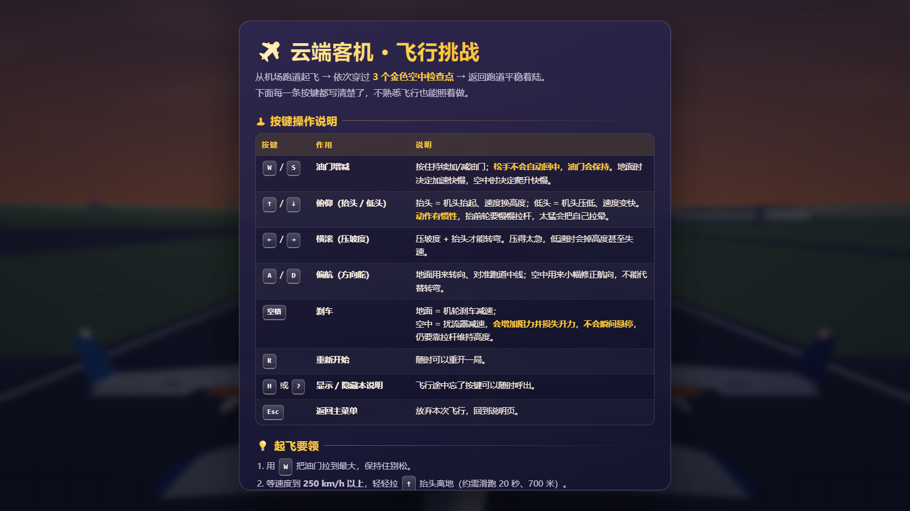
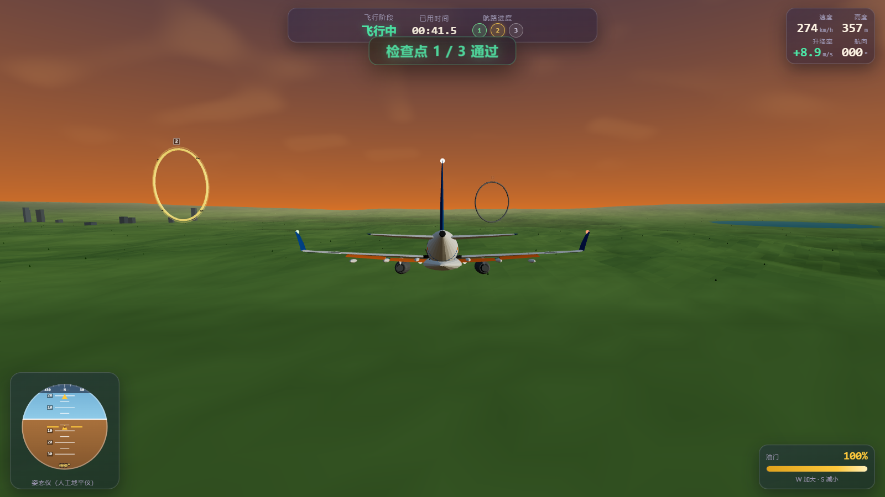
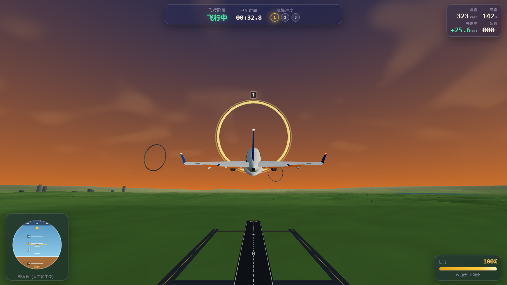
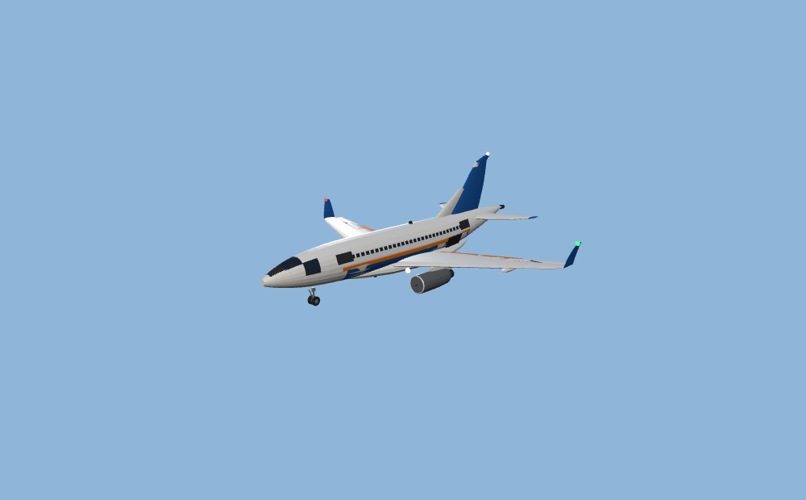
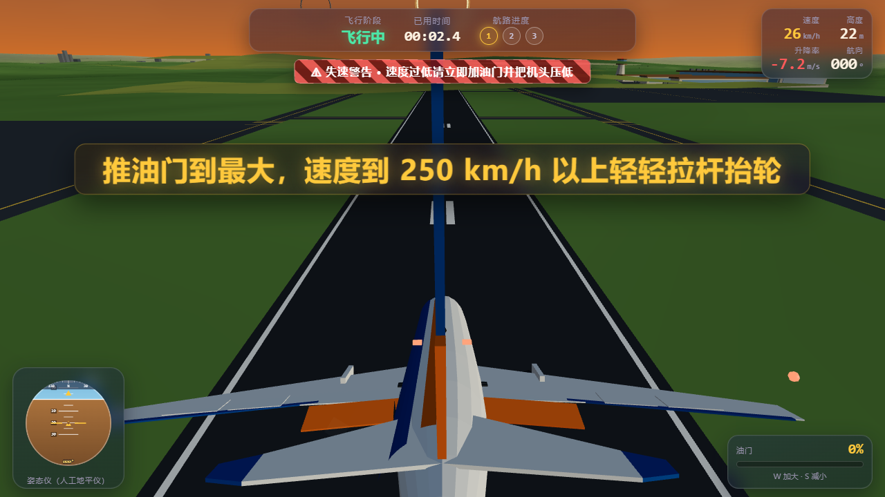
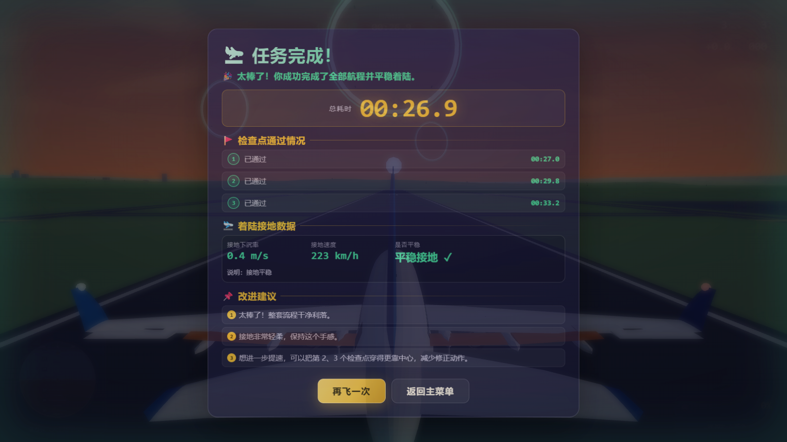

# ✈️ Airplane · SpaceBunny

> 一款纯前端的 3D 客机飞行游戏 —— 从机场跑道起飞，依次穿越 3 个空中检查点，再返回跑道着陆。
> **无需安装、无需联网、无需登录，打开网页就能玩。**

## 🎮 在线试玩

### 👉 [https://jimmy-ai-studio.github.io/Airplane-SpaceBunny/](https://jimmy-ai-studio.github.io/Airplane-SpaceBunny/)

**点击上面链接即可直接开始游戏**（如果没反应，说明浏览器拦截了本地文件，请在地址栏确认是 `jimmy-ai-studio.github.io` 开头的 https 地址）。

---

[](https://jimmy-ai-studio.github.io/Airplane-SpaceBunny/)
[](https://threejs.org/)
[](LICENSE)

---

## 📸 画面

| 起步菜单 | 穿越检查点 |
|---|---|
|  |  |

| 巡航飞行 | 客机外形 |
|---|---|
|  |  |

| 机场跑道 | 着陆成功 |
|---|---|
|  |  |

---

## 🎯 玩法

三步通关：

1. **起飞** —— 按住 `W` 加大油门，滑跑约 20 秒 / 700 米，速度到 **250 km/h** 以上后轻拉 `↑` 抬轮
2. **穿越检查点** —— 依次穿过 3 个金色光环，**必须按 1 → 2 → 3 顺序**（只算当前高亮的那一个）
3. **返场着陆** —— 对准跑道中线下降接地，接地下沉率要低于 1.8 m/s，然后收油 + 刹车停稳

### ✅ 成功条件
三个检查点全部通过 **且** 在跑道内安全着陆 **且** 停稳

### ❌ 失败条件（任一即判负）

| 原因 | 判定 |
|---|---|
| 撞地解体 | 下沉率 > 3 m/s 触地 |
| 重着陆 | 下沉率 > 1.8 m/s |
| 接地速度过高 | > 80 m/s（288 km/h） |
| 接地姿态不稳 | 坡度 > 12° 或俯仰 > 9° |
| 落在跑道外 | 跑道中线 ±30 m 之外 |
| 撞上建筑物 | 航站楼 / 机库 / 塔台 |
| 超出管制空域 | 高度 > 3000 m 或飞出边界 |
| 超时 | 超过 10 分钟 |

任何结局都能按 `R` 立即重开，重开会清空上一局全部状态。

---

## 🕹️ 操作说明

| 按键 | 作用 | 说明 |
|---|---|---|
| **W / S** | 油门增减 | **保持型** —— 松手后油门停在当前位置，不会自动回中 |
| **↑ / ↓** | 俯仰（抬头 / 低头） | 有惯性。抬头要慢慢拉杆，拉太快会失速 |
| **← / →** | 横滚（压坡度） | 压坡度 + 抬头才能转弯；松杆自动回平 |
| **A / D** | 偏航（方向舵） | 地面用于转向对准跑道；空中微调航向 |
| **空格** | 刹车 | 地面 = 机轮刹车；空中 = 扰流器减速（增阻 + 损失升力，**不会瞬间悬停**） |
| **R** | 重新开始 | 任何时候都能重开 |
| **M** | 静音开关 | 关闭/开启全部声音 |
| **H** / **?** | 显示/隐藏操作说明 | |
| **Esc** | 返回主菜单 | |

### ⚠️ 飞行提示

- **转弯一定要拉杆** —— 压坡度会损失垂直升力（垂直分量 = L·cos(坡度)），不拉杆就会持续掉高度。坡度超过 32° 时屏幕会给出警告和损失百分比
- **自动保护** —— 坡度超 35° 后飞机会像真实空客（FBW）一样自动协调拉杆；迎角过大时也会自动压杆保护。所以不会"一拉到底就坠毁"，但仍建议自己配合操作
- **襟翼** —— 地面滑跑时自动全放（提供升力），离地后保持，巡航时自动收起
- **超速警告** —— 超过 756 km/h 会显示红色警告

---

## 📊 仪表盘

| 显示 | 单位 | 说明 |
|---|---|---|
| 速度 | km/h | 对地速度 |
| 高度 | m | 海拔高度 |
| 升降率 | m/s | ↑ 绿 / ↓ 红 |
| 油门 | % | 保持型 |
| 姿态仪 | — | 人工地平仪，含俯仰刻度与横滚指示 |
| 航向 | ° | 000 = 沿跑道起飞方向 |
| 任务进度 | ①②③ | 当前检查点高亮闪烁 |

---

## 🛠️ 本地运行

游戏是纯静态的，但**必须用 HTTP 服务器打开**（浏览器会拦截 `file://` 下的 ES Module）。

```bash
# 需要 Node.js 18+
node tools/serve.mjs
# 然后访问 http://127.0.0.1:8123/
```

Windows 下也可以直接双击 `启动游戏.bat`。端口被占用时会自动往后找（8123 → 8124 → …），终端会显示实际端口。

更详细的本地运行与飞行技巧见 **[启动说明.md](启动说明.md)**。

---

## 🧪 运行测试

```bash
node tools/physics-bench.mjs   # 29 项无头物理测试（不需浏览器，秒级完成）
node tools/e2e.mjs            # 25 项浏览器判定逻辑测试（需先启动服务器）
node tools/e2e-realplay.mjs   # 真实键盘飞行测试
node tools/verify-audio.mjs   # 8 项音频系统验证（需先启动服务器）
```

`physics-bench.mjs` 是这个项目的特色：把飞行物理引擎剥离出来在 Node 里直接跑，
所有飞行品质问题（失速、改出、滚转阻尼、接地判定）都能在秒级内定位，不必进浏览器盲调。

---

## 🏗️ 项目结构

```
.
├── index.html              页面入口（也是 Pages 的站点根）
├── styles.css              HUD / 菜单 / 结果页样式
├── 启动游戏.bat             Windows 一键启动
├── 启动说明.md              详细玩法与飞行技巧
├── src/
│   ├── main.js             主循环 / 状态机 / 胜负判定
│   ├── core/
│   │   ├── constants.js    全局常量（唯一数据源）
│   │   └── physics.js      飞行物理引擎
│   ├── systems/
│   │   ├── input.js        键盘输入
│   │   ├── audio.js        音频引擎（Web Audio 实时合成）
│   │   └── chase-camera.js 第三人称跟随相机
│   ├── world/
│   │   ├── environment.js  机场 / 地形 / 天空 / 光照
│   │   ├── craft.js        客机模型（程序化生成）
│   │   └── checkpoints.js  空中检查点
│   └── ui/
│       └── hud.js          仪表盘 / 菜单 / 结果页
├── tools/                  本地服务器与测试脚本
├── vendor/three.module.js  Three.js r160（本地化，可离线）
├── .github/workflows/      GitHub Pages 自动部署
└── shots/                   截图
```

---

## 🔬 技术要点

- **Three.js r160**，已本地化到 `vendor/`，**完全离线可运行**，不依赖任何 CDN
- 全部模型、材质与**音效**均程序化生成，无任何外部素材文件或付费生成服务
- 音频基于 Web Audio API 实时合成，含压限器防止多音叠加削波
- 渲染规模：`draw call ≈ 145`，`三角面 ≈ 17 万`，1080p / 60fps
- 物理：**200Hz 定步长积分**的气动静稳定性模型，包含失速、α 保护、协调转弯、滚转阻尼、大坡度自动协调

### 几个值得一提的设计

**飞机必须有惯性** —— 姿态角速度用一阶惯性逼近（操纵输入 → 目标角速度，实际角速度按时间常数追随），
所以不会有"瞬间转"或"瞬停"。空中按刹车是扰流器，增阻 + 损失升力，飞机仍会继续前飞并缓慢下沉。

**必须有气动静稳定性** —— 这是飞机能飞的前提。操纵输入只是"偏置力矩"，
真正让飞机回到平飞配平的是静稳定性产生的恢复力矩。缺了它，松杆就会持续俯冲。

**接地要做扫掠检测** —— 高速时单帧位移可达 1.3 m 以上，只比较当前高度会漏检、
直接穿过地面。必须用"上一帧位置 → 当前位置"的线段判定。

**倾覆与失速保护** —— 对应真实客机的 FBW 功能：
- α 限制保护：迎角接近临界时强制压杆
- 大坡度自动协调：坡度超 35° 自动加抬头量

---

## 🛠️ 研发工具

本项目由 **[WorkBuddy](https://www.workbuddy.cn/)** 辅助开发 —— 一个以多智能体协作见长的
AI 工作台。实际开发方式：

- 由**多个专职 Agent 并行**承担不同模块：环境与地形、客机模型、检查点、HUD 与页面外壳
- Agent 产出前先固化**共享契约**（`constants.js` 作为唯一数据源），避免并行开发的接口冲突
- 物理引擎与主循环由主控 Agent 直接实现
- 每个 Agent 的交付都经过**独立的语法检查与实机验证**才合入
- 缺陷修复遵循"先定位根因、再一次性修好"，不做反复打补丁

其中一位 Agent 在建模过程中自查出并修复了 4 个自身引入的缺陷
（如：负缩放做左右镜像导致面被背面剔除、场景无 IBL 时高 `metalness` 材质发黑等）。

**自动化测试**也是这个流程的一部分：物理台架 29 项、判定逻辑 25 项、真实键盘飞行 14 项，
其中「真实键盘穿越检查点 1」是在真实 Chromium 里用真实按键事件跑通的。

---

## 📄 License

MIT — 见 [LICENSE](LICENSE)。

Three.js 采用 MIT 许可证，版权归其作者所有。
